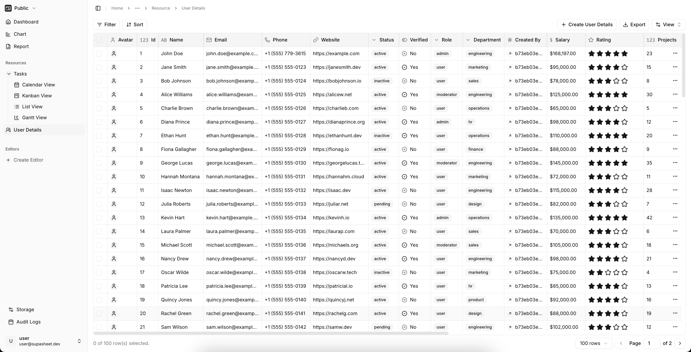

<div align="center">
  <h1 align="center">
  Supasheet
  </h1>
  <h3 align="center"><strong>The admin panel you've been waiting for</strong></h3>
  <p>Supasheet is a powerful admin panel designed to work seamlessly with Supabase. It provides an intuitive interface for managing your data, users, and settings, making it easier than ever to build and maintain your applications.</p>
  <p>Try out Supasheet using our hosted version at <a href="https://supasheet.app">supasheet.app</a></p>
</div>

<h1 align="center">
   <picture>
   <source media="(prefers-color-scheme: dark)" srcset="public/images/bg-dark.png">
   
   </picture>
</h1>

## Features

- [x] Authentication
- [x] User management
- [x] Authorization (RBAC)
- [x] Resource (CRUD)
- [x] Customizable UI
- [x] Internationalization (i18n)
- [x] SQL Editor
- [x] Dashboard
- [x] Analytics
- [x] Report
- [x] File Storage
- [x] Chart
- [x] Audit Logs

## Getting Started

To get started with Supasheet, follow these steps:

1. Clone the repository:

   ```bash
   git clone https://github.com/htmujahid/supasheet.git
   ```

2. Navigate to the project directory:

   ```bash
   cd supasheet
   ```

3. Install the dependencies:

   ```bash
   npm install
   ```

4. Place your Supabase URL and API key in the `.env.dev` file:

   ```env
   NEXT_PUBLIC_SUPABASE_URL=your_supabase_url
   NEXT_PUBLIC_SUPABASE_ANON_KEY=your_supabase_api_key
   ```

5. Start the development server:

   ```bash
   npm run dev
   ```

6. Open your browser and navigate to `http://localhost:3000` to see the application in action.

## Technology Stack

1. **Frontend**: Next.js, React, Tailwind CSS, Shadcn UI
2. **Backend**: Supabase (PostgreSQL, Auth, Storage)
3. **Deployment**: Vercel (for frontend), Supabase (for backend)
4. **MISC**: Diceui, React Query, TanStack Table, React Hook Form, Zod, i18next

## Credits

- **Makerkit**

## Contributing

We welcome contributions to Supasheet!
